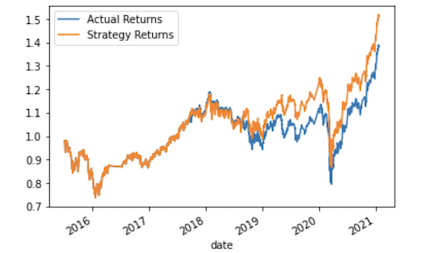
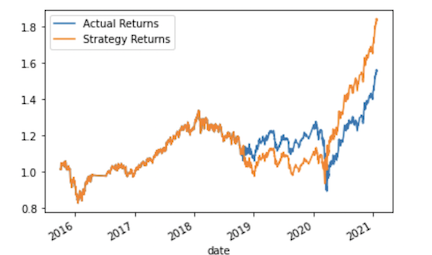
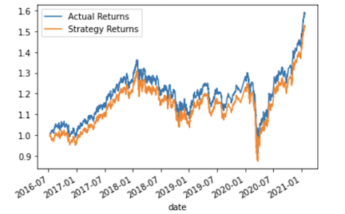

# Algorithmic_Trading_Bot

## Performance Conclusions
The following image of our cumulative return plot shows actual returns vs. the strategy returns.

The following image is the first alternative plot. In this plot the data has been sliced into different periods. The time period has been
doubled from 3 months in the previous plot to 6 months. The conclusion for this adjustment is the selling predictions precision has been negatively
affected by 50%. I do not recommend this alternative adjustment.

The following image is the second alternative plot. In this plot the the trading algorithm has been modified by adjusting the SMA
input features. In this instance both windows where adjusted . "Short" from 4 to 30 and "Long" from 100 to 200. After reviewing the data 
and plot we can see that once again the selling precision has been affected negatively. Although the buy prediction precision is very high
ideally we would want a more balanced algorithm.

At this time our findings show that the original parameters worked best although i believe with more testing we would learn that
historically the more time and data available for the machine to learn the more accurate the algorithm becomes.

